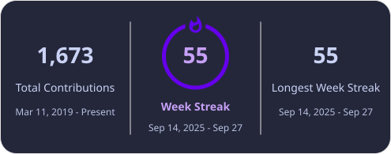

  

<!-- POKEMON:START -->

<!-- POKEMON:END -->

- 👋 Hi, I’m Olamide!
- 👀 I have a keen interest in Software Programming and Unity Development.
- 🌱 My work experience encompasses Azure Cloud Solutions, with a focus on migration, backup, DevOps, and security.

  

---

## Skills

<!---
Olaowo5/Olaowo5 is a ✨ special ✨ repository because its `README.md` (this file) appears on your GitHub profile.
You can click the Preview link to take a look at your changes.
--->

---

## Stats

<!-- Cards below are generated daily by .github/workflows/profile-cards.yml -->

---

<picture>
  <source media="(prefers-color-scheme: dark)" srcset="https://raw.githubusercontent.com/Olaowo5/Olaowo5/HEAD/profile/snake-dark.svg" />
  <source media="(prefers-color-scheme: light)" srcset="https://raw.githubusercontent.com/Olaowo5/Olaowo5/HEAD/profile/snake.svg" />
  
</picture>
